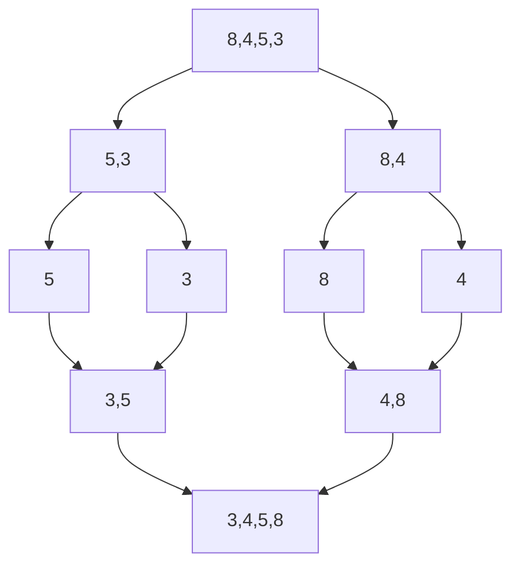

## 归并排序
> 分治法的思想是把问题进行分解为规模比元问题小的几个问题，递归地求解这些子问题，然后再合并这些已经解决的子问题获得源问题的解
> 归并排序算法的思想是将数列进行分割，直到分割到长度为1的数列，将这些长度为1的数列逐步进行合并排序。

**具体过程如下图**
+ 拆分和合并过程如下图



**具体代码**
```java
public class MergeSort {

	/**
	 * 对数组进行归并排序
	 * @param sortArray	要进行排序的数组
	 * @param start	排序的开始位置
	 * @param end 排序的结束位置
	 */
	public void mergeSort(int[] sortArray, int start, int end) {
		if (start < end) {// 如果要排序的位置长度不为一，进行分割
			int point = (start + end) / 2; // 获取要进行分割的位置
			// 利用递归
			mergeSort(sortArray, start, point);// 继续对分割后的左边的数组进行归并排序
			mergeSort(sortArray, point + 1, end);// 继续对分割后的右边的数组进行归并排序

			merge(sortArray, start, point, end);// 对上面point左边和point右边已经排好序的数组进行合并
		}
	}

	/**
	 * 对point左边和右边已经排好序的数组进行排序
	 * 排序的方式是将sortArray数组从point的位置进行分割，分割成两个数组，而这两个数组是已经排好序的
	 * 然后一次从这两个数组里面取出元素进行比较，取出较小的元素依次放在sortArray的对应位置
	 * @param sortArray 要排序的数组
	 * @param start 排序的开始位置
	 * @param point 从哪里分割这个数组，分割后的数组左右两侧都是已经排好序的
	 * @param end 排序的结束位置
	 */
	public void merge(int[] sortArray, int start, int point, int end) {

		int leftArrayLength = point - start + 1; // 获取左边已经拍好序的数组的长度
		int rightArrayLength = end - point;// 获取右边已经排好序的数组的长度

		// 定义左边和右边的数组，长度为length + 1的原因是要在数组最后设置一个哨兵数值，来判断已经到了数组最后的一个元素
		int[] leftArray = new int[leftArrayLength + 1];
		int[] rightArray = new int[rightArrayLength + 1];

		// 设置哨兵
		leftArray[leftArrayLength] = Integer.MAX_VALUE;
		rightArray[rightArrayLength] = Integer.MAX_VALUE;

		// 初始化左边和右边的数组
		for (int i = 0; i < leftArrayLength; i++) {
			leftArray[i] = sortArray[start + i];
		}
		for (int i = 0; i < rightArrayLength; i++) {
			rightArray[i] = sortArray[point + i + 1];
		}

		int leftPoint = 0;// 标志左边数组要比较数值的位置
		int rightPoint = 0;// 标志右边数组要比较的值的位置
		for (int k = start; k <= end; k++) {
			// 依次从两个数组里面取出最小的值，放在总的数组里面
			if (leftPoint < leftArrayLength && leftArray[leftPoint] <= rightArray[rightPoint]) {
				sortArray[k] = leftArray[leftPoint];
				leftPoint++;
			} else if (rightPoint < leftArrayLength && leftArray[leftPoint] > rightArray[rightPoint]) {
				sortArray[k] = rightArray[rightPoint];
				rightPoint++;
			}
		}
	}
}

```

上面的方法就是如果分割的子数组的长度不为一的话，就对数组进行分割，直到所有的子数组长度为1为止。一旦子数组的长度为1，那么mergeSort这个函数就会返回，返回后在[start，end]范围内的point两侧是已经拍好序的，继续执行下面的merge方法，对两侧排好序的数组进行排序。利用递归依次向下分割，再向上合并排序，最后完成对数组的排序

**[查看源代码](https://github.com/zuoyandeyingguang/JavaLearning/tree/master/src/com/mengfly/suanfa/MergeSort.java)**